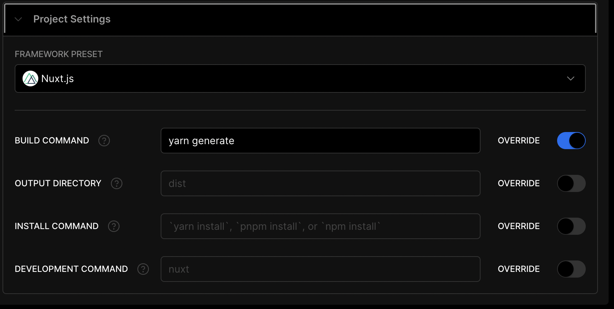

# nuxt3-generate-static-vercel-image

Feature request: Support (nuxt3) nuxt/image with vercel provider for static app -> `nuxt generate`.

Hosted on vercel: [https://nuxt3-generate-static-vercel-image.vercel.app](https://nuxt3-generate-static-vercel-image.vercel.app)

Reproduction example for [https://github.com/nuxt/image/issues/617](https://github.com/nuxt/image/issues/617)

## Behaviour

| Expected                                                                                                       | Actual                                                                                                                       |
|----------------------------------------------------------------------------------------------------------------|------------------------------------------------------------------------------------------------------------------------------|
| Vercel config is generated and contains the "images" property which configures the Image Optimization feature. | website is generated, `<nuxt-image>` components are processed fine, but vercel config does not contain the "images" property |

### Website renders without images working:


###  Vercel settings:



## Setup

Make sure to install the dependencies:

```bash
# yarn
yarn install
```

## Development Server

Start the development server on http://localhost:3000

```bash
npm run dev
```

## Production

Build the application for production:

```bash
yarn generate
```

Locally preview production build:

```bash
yarn preview
```

## Vercel deploy

```bash
vercel
```
